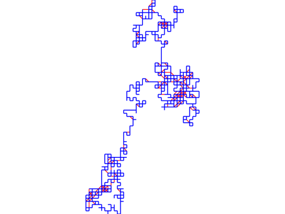

# Planar Pose Graph Optimization Datasets

The [datasets](/datasets) folder contains the ground truth for the Grid1000, M3500, and City10000 datasets as well as 5 additional datasets per graph with increasing measurement noise applied, for a total of 15 trial dataset graphs. The datasets are in the .g2o file format, as detailed in [g2oVStoro](https://www.dropbox.com/s/uwwt3ni7uzdv1j7/g2oVStoro.pdf?e=1&dl=0) by Luca Carlone.

### Grid1000 Dataset
Ground truth Grid1000 dataset:



### M3500 Dataset
Credit for the ground truth M3500 dataset goes to the authors of:
```asm
@inproceedings{olson2006fast,
  title={Fast iterative alignment of pose graphs with poor initial estimates},
  author={Olson, Edwin and Leonard, John and Teller, Seth},
  booktitle={Proceedings 2006 IEEE International Conference on Robotics and Automation, 2006. ICRA 2006.},
  pages={2262--2269},
  year={2006},
  organization={IEEE}
}
``` 
Ground truth M3500 dataset:


### City10000 Dataset
Credit for the ground truth City10000 dataset goes to the authors of:
```asm
@article{kaess2008isam,
  title={iSAM: Incremental smoothing and mapping},
  author={Kaess, Michael and Ranganathan, Ananth and Dellaert, Frank},
  journal={IEEE Transactions on Robotics},
  volume={24},
  number={6},
  pages={1365--1378},
  year={2008},
  publisher={IEEE}
}
``` 
Ground truth City10000 dataset:

